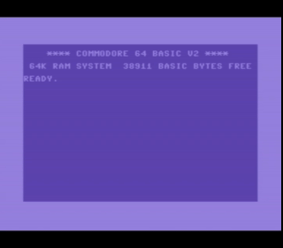
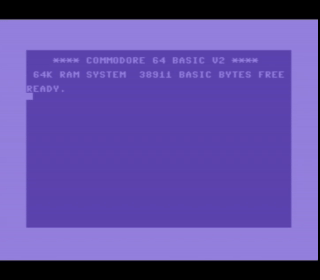

# Running neural networks on the C64

Demo neural network for the C64, an 8-bit homecomputer released in 1982. Implements a simplified version of LeNet for recognizing written numerals on 14x14 grayscale images, using an [Atmega implementation by the creator of onnx2c](https://github.com/kraiskil/onnx2c/tree/master/examples/atmega_mnist) as reference. Calculations are done on the MOS 6510, using the standard 64k RAM hardware setup.





## Setup and usage

Download the llvm-mos SDK (https://github.com/llvm-mos/llvm-mos-sdk#getting-started) and put it in this directory, so that ./llvm-mos/bin/mos-c64-clang is a valid path. Alternatively change the CLANG_MOS in the Makefile. To generate custom .onnx files, installing onnxsim via pip is recommended.  
Then execute following commands:  
```git submodule update --init --recursive
mkdir onnx2c/build
cd onnx2c/build  
cmake ..  
make  
cd ../..  
make
```

The resulting mnist.prg file can be loaded into a C64 like a normal .PRG file, e.g. with the command:  
```
LOAD "MNIST.PRG",8,1  
RUN  
```

## Controls

Use joystick or arrow keys to move the cursor, press fire or spacebar to toggle between filled in pixel (127) or zero. 'c' button to clear the picture (set everything to zero). Press enter button to run evaluation.

## Technical details

[Technically this wouldn't be the first time a neural network was run on the C64](https://www.fourmilab.ch/documents/commodore/BrainSim/). However, that one has only two layers and does not use techniques just recently introduced at that time like backpropagation or convolution which were crucial milestones towards modern computer vision NNs.

Neural networks are normally represented with floating point variables, which the 6510 does not support in hardware, and while the C64 has a software floating point library, using that would be unbearingly slow.
Luckily, a similar situation with some microcontrollers, mobile devices and Tensor processing units made quantization of neural networks from floating point format to an integer format very popular. I found a brilliant special tool named onnx2c which kills two birds with one stone by converting any neural network into dependency-less C code while optionally also quantizing it to 8-bit integers. This C code is then compiled into a C64 executable via the recently released LLVM-MOS compiler.

The neural network is normally trained on the MNIST number recognition dataset using PyTorch, exported in the ONNX format, and then ported to C in a non-standard way through onnx2c's (experimental) quantization feature which first normalizes the weights to (-1, 1) in FLOAT32 and then quantizes them into (-127, 127) in INT8.
This corresponds to [PyTorch's dynamic quantization](https://pytorch.org/docs/stable/quantization.html), though this does not take into account the values that are passed between layers. However, it is crucial that the values ranges of the numbers fit together and that calculations do not end up being quantized into a range beyond what INT8 can handle. [A great source to read about quantization.](https://leimao.github.io/article/Neural-Networks-Quantization/)

As a solution, the output of some layers is constrained into a roughly (-1, 1) range during training. This is accomplished by modifying the loss function to add a value that represents how much the values go beyond the (-1, 1) range.
The loss is added with a factor of about 0.0035 so that the goal of keeping the range will not compete with the network's original goal of classifying numerals (so the network will still converge towards the original task of image recognition instead of converging mainly towards only keeping the range).
With this constraint, more epochs are requires to reach peak accuracies. With the range constraint, 90% accuracy is achieved after about 50 epochs, which converges towards a 93-95% accuracy if trained to approximately 200 epochs.

## Performance

One classification of a 14x14 8-bit integer grayscale picture takes somewhere around 19-20 seconds, which is not too terrible for a demo and is about what you would expect for a CPU of this type. Taking into account 3000 characters per page that would amount to about 16-17 hours to scan the equivalent of one page which is not very great but would have been incredible for 80s medium price consumer hardware.

The worst performance hit is probably going to be the 6510's lack of a hardware multiplication instruction, therefore all multiplications have to be done as a series of additions and bit shifts. The absolute majority of the processing time is actually spent calculating the convolution operations (5x5 kernel). The 6510 does not apper to be struggling performance wise with ReLU layers, a "reshape" operation that moves data around, or even a general matrix multiplication with a small amount of data. So the obvious bottleneck here are the multiplications of the convolution operations before the data is reduced in size, after which processing takes rather little time.

The raw quantized neural network code generated by onnx2c won't immediately get compiled because it technically still contains float operations which are however redundant (e.g. multiplying integers by 1.0), and LLVM-MOS does not support floating point arithmetics yet. These are automatically patched out by the Makefile. The reshape operations emitted by the tool could probably all be replaced by a memcpy call and most likely it can even be omitted entirely with some pointer tricks. However, the performance impact of this is rather small.

The default setup of LLVM-MOS works with the OS enabled and standard memory layout, which is also used here. While it looks like the entire program barely fits into the C64's BASIC program memory, a non-negligible part of it is the GUI and pre-programmed numbers. The neural network itself uses something around 20K bytes of program space. More complex neural networks could be run if the C64's memory is remapped.

## License

See the LICENSE file.
